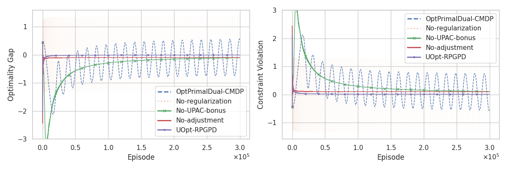

# Official Implementation of "A Policy Gradient Primal-Dual Algorithm for Constrained MDPs with Uniform PAC Guarantees" [Experiments in Section 6]

This repository is the official implementation of UOpt-RPGPD algorithm.

* You can see the implementation in [UOpt-RPGPD-ablation.ipynb](UOpt-RPGPD-ablation.ipynb).




## Requirements

```bash
# make sure you are in Uniform-PAC-Primal-Dual-CMDP/
poetry install
```

## Run Experiments and Plot the results

Run all the cells in [UOpt-RPGPD-ablation.ipynb](UOpt-RPGPD-ablation.ipynb).